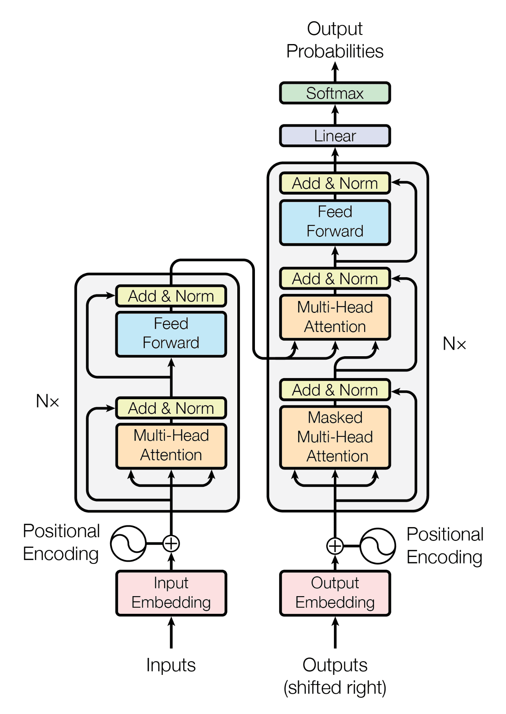
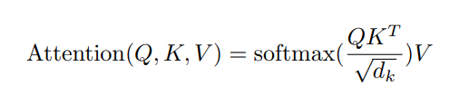
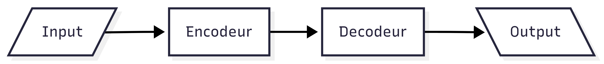
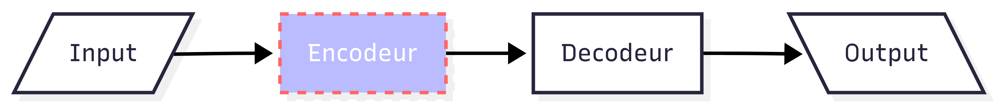
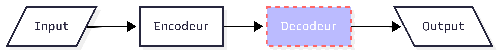
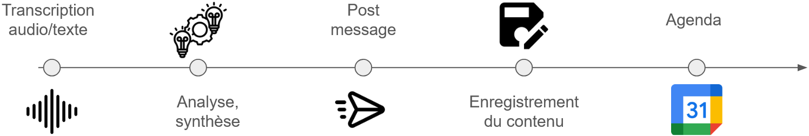

<!-- .slide: -->

<section>
  <h1>Les transformers</h1>
  
<a href="https://proceedings.neurips.cc/paper_files/paper/2017/file/3f5ee243547dee91fbd053c1c4a845aa-Paper.pdf">Attention is all you need</a>

  

    

      

        
      

      

          
          
      

    

  

</section>

##==##
# LLM

## Modèle d'embedding

Technique d'apprentissage automatique qui transforme des données complexes et de haute dimension en vecteur de nombres réels

  

### *Cas d'usage*
Idéal pour la classification de texte, l'analyse de sentiments, la recherche sémantique et la réponse à 
des questions précises où la compréhension fine du contexte est cruciale.

Exemple : les modèles basés sur l'architecture BERT 

##==##

# LLM
## Modèle dit génératif

Vu comme un moteur de génération
  

### *Cas d'usage*
Parfait pour la rédaction d'articles, les chatbots conversationnels, le résumé de textes, 
l'écriture de code et toute tâche nécessitant de produire de nouvelles séquences de mots.

Exemple : GPT

##==##

<section>
<h1>Agent IA</h1>
  
Système qui utilise un grand modèle de langage (LLM) comme cerveau central pour raisonner, planifier et exécuter des tâches complexes de manière autonome.

    
  

    
  

</section>
