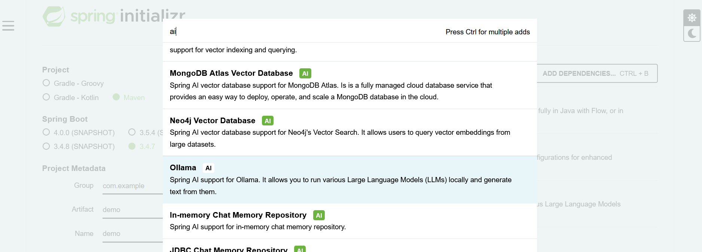

<!-- .slide: -->

# Initialisation de l'application

Allez sur le site : https://start.spring.io/
<br></br>
<div class="r-hstack">
  
</div>

##==##

# Configuration du projet MAVEN

## gestion des dépendances

```xml
<dependencyManagement>
  <dependencies>
    <dependency>
      <groupId>org.springframework.ai</groupId>
      <artifactId>spring-ai-bom</artifactId>
      <version>${spring-ai.version}</version>
      <type>pom</type>
      <scope>import</scope>
    </dependency>
  </dependencies>
</dependencyManagement>
```

## Spécification du repo

```xml
<repositories>
  <repository>
    <id>spring-milestones</id>
    <name>Spring Milestones</name>
    <url>https://repo.spring.io/milestone</url>
    <snapshots>
      <enabled>false</enabled>
    </snapshots>
  </repository>
</repositories>
```

##==##

# Starter spring boot pour IA

Des starter disponibles pour les principaux fournisseurs de model LLM ...
```xml
<dependency>
  <groupId>org.springframework.ai</groupId>
  <artifactId>spring-ai-openai-spring-boot-starter</artifactId>
</dependency>

<dependency>
  <groupId>org.springframework.ai</groupId>
  <artifactId>spring-ai-starter-model-ollama</artifactId>
</dependency>
```
<br><br>
... ainsi que les fournisseurs de bases de données vectorielles
```xml
<dependency>
  <groupId>org.springframework.ai</groupId>
  <artifactId>spring-ai-starter-vector-store-pgvector</artifactId>
</dependency>

<dependency>
  <groupId>org.springframework.ai</groupId>
  <artifactId>spring-ai-advisors-vector-store</artifactId>
</dependency>
```
##==##

# Chat Model API

L'échange entre une application et un LLM se fait par appel d'APIs qui peuvent varier d'un LLM à l'autre. Spring AI met à disposition l'API ```ChatModel``` 
pour permettre au développeur d'intéragir avec différents modèles d'IA tout en ayant à modifier le moins de code possible.

Deux possibilités :

* ```ChatModel``` pour du code bloquant

```java
public interface ChatModel extends Model<Prompt, ChatResponse> {

	default String call(String message) {...}

    @Override
	ChatResponse call(Prompt prompt);
}
```

* ```StreamingChatModel``` pour gérer des flux de données

```java
public interface StreamingChatModel extends StreamingModel<Prompt, ChatResponse> {

    default Flux<String> stream(String message) {...}

    @Override
	Flux<ChatResponse> stream(Prompt prompt);
}
```
