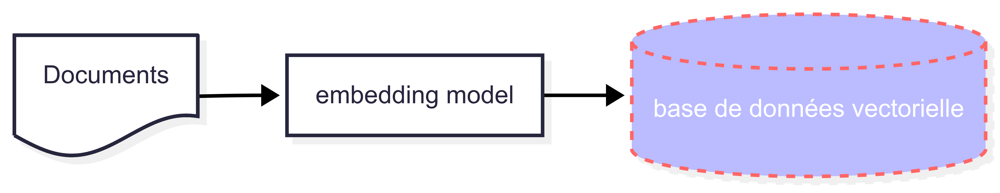
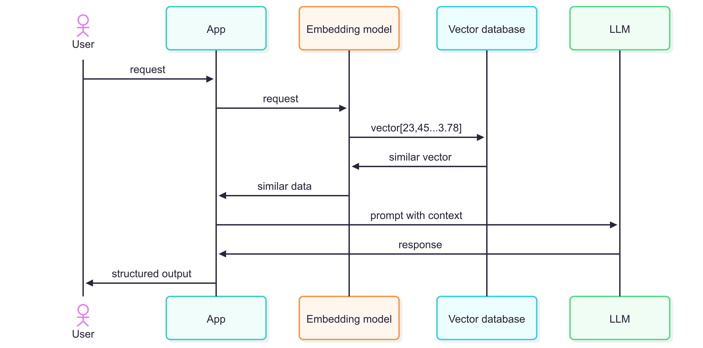

<!-- .slide: -->

# Retrieval Augmented Generation (RAG)

## Qu'est-ce que le processus de RAG

L'intérêt principal du RAG est de rendre les grands modèles plus fiables, plus précis et plus pertinents en leur donnant accès à une connaissance 
externe et contrôlée. Plutôt que de se baser uniquement sur les données de leur entraînement initial

L'architecture RAG est la combinaison d'un modèle d'embedding, d'une base de données vectorielle et d'un LLM. Son fonctionnement se décompose en deux étapes :
<br></br>
1. **Ajout des documents externes en base**

<div class="r-stack">
  
</div>


##==##

# Retrieval Augmented Generation (RAG)

## Qu'est-ce que le processus de RAG

2. **Envoi d'une requête au LLM**
<div class="r-stack">
  
</div>

##==##

# Retrieval Augmented Generation (RAG)

## Implémentation spring AI

1. **Insérer un document en base**

Spring boot propose des starters pour les principales base de données vectorielles du marché. L'exemple suivant tire la dépendance du starter pgvector, une extension de
PostgreSQL :
```xml
    <!-- Vector Databases -->
    <dependency>
      <groupId>org.springframework.ai</groupId>
      <artifactId>spring-ai-starter-vector-store-pgvector</artifactId>
    </dependency>
```

Avant d'être inséré en base, le document doit passer par une étape fondamentale, son découpage en morceaux (chunk).
Pour cela, on s'appuie sur l'implémentation ```TokenTextSplitter``` de l'interface ```DocumentTransformer```.

```java
    TextSplitter textSplitter = new TokenTextSplitter(20,5,5,500,true);
    List<Document> documents = new TextReader(doc).get();  // Document Reader
    List<Document> splitDocuments = textSplitter.apply(documents);  // Document Transformer
    vectorStore.write(splitDocuments); // Document Writer
```

##==##
# Retrieval Augmented Generation (RAG)

## Implémentation spring AI

2. **Utilisation des advisors**

La dépendance ci-dessous vous permettra d'utiliser l'advisor ```QuestionAnswerAdivsor``` mise à disposition par Spring pour requêter dans une base de données vectorielles : 

```xml
    <dependency>
      <groupId>org.springframework.ai</groupId>
      <artifactId>spring-ai-advisors-vector-store</artifactId>
    </dependency>
```

Il suffira de l'ajouter au chatClient de la manière suivante :

```java
ChatResponse response = ChatClient.builder(chatModel)
        .build().prompt()
        .advisors(QuestionAnswerAdvisor.builder(vectorStore).build())
        .user(userText)
        .call()
        .chatResponse();
```

NOTE : Il est possible d'implémenter sa propre recherche de similarité afin d'être plus précis : 

```java
  SearchRequest searchRequest = SearchRequest
    .builder()
    .filterExpression(
      // préciser la recherche de document dans la catégorie adminrh
      b.eq("category", "adminrh")
        .build()
    )
```

