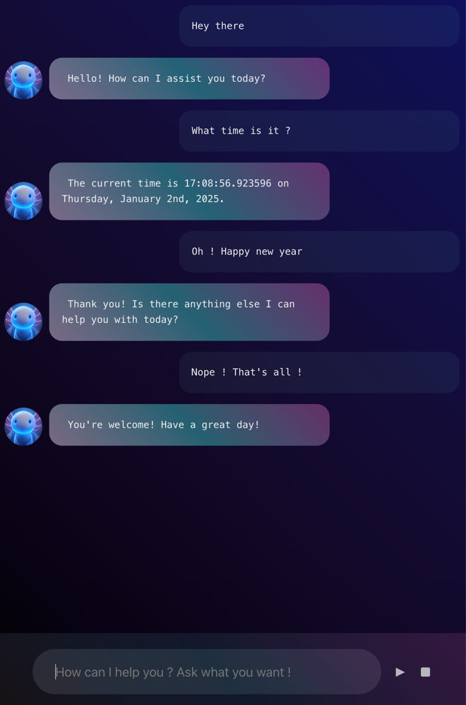

# Aixolotl Chat Assitant

A cool axolotl using small language models to answer corportate questions.

> Our preferred models :
> - nemotron-mini:4b-instruct-q5_K_M
> - granite3-dense:2b
> - llama3.2:3b-instruct-q4_K_M
>
> Correct performance with 2,6 GHz Intel Core i7 (6 cores) on MacOS

# UI preview

# ⚙️ Stack
- Ollama (0.5.4)
- Spring AI (1.0.0-M5)
- Java 21
- React 17 (Hilla)
- Testcontainers
- Docker

# 🧠 Functions
- Current date and time

## Troubleshooting
- llama/nvidia models are struggling with function calling 😭 

## Project structure

<table style="width:100%; text-align: left;">
  <tr><th>Directory</th><th>Description</th></tr>
  <tr><td><code>src/main/frontend/</code></td><td>Client-side source directory</td></tr>
  <tr><td><code>src/main/java/&lt;groupId&gt;/</code></td><td>Server-side 
source directory, contains the server-side Java views</td></tr>
  <tr><td>&nbsp;&nbsp;&nbsp;&nbsp;<code>Application.java</code></td><td>Server entry-point</td></tr>
</table>

## Useful links

- Read the documentation at [hilla.dev/docs](https://hilla.dev/docs/).
- Ask questions on [Stack Overflow](https://stackoverflow.com/questions/tagged/vaadin) or join our [Forum](https://vaadin.com/forum).
- Report issues, create pull requests in [GitHub](https://github.com/vaadin/hilla).
